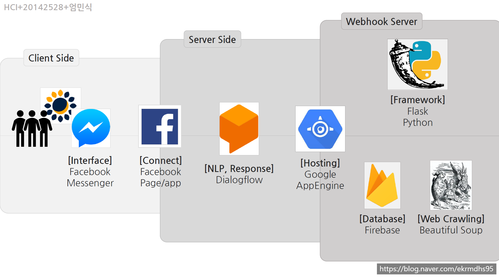

# 해바라기 일기장


[네이버 블로그](https://blog.naver.com/ekrmdhs95)에도 동일 내용이 있습니다. 워터마크는 네이버 블로그 주소입니다.

## 요약
### 핵심 전달 가치
챗봇 기반 대화형 일기장 앱 '해바라기 일기장'입니다. **소중한 사람과 대화하듯 하루를 따뜻하게 마감해보세요.**


### 배운 점
- 챗봇 API 에 데이터 학습
- Webhook 서버를 정의하여 가로챈 챗봇의 input에 애플리케이션 로직을 적용
- 웹 크롤링으로 웹 문서를 긁어오기
- 웹 호스팅 서버 이용

## 플랫폼
주로 여러 API를 엮어 기능을 구현했습니다.

- 인터페이스: 페이스북 메신저 API
- 챗봇 메시지 처리: Dialogflow
- 웹훅 서버: Flask(Python)
- 웹훅 서버 호스팅: Google AppEngine
- 웹 크롤링: Beautiful Soup(Python)



## 기능
### 일기 작성 / 저장 / 불러오기
챗봇에게 오늘 있던 일을 얘기하면 와 같이 대답해주며 일기를 저장 및 관리합니다.

1. '오늘 일기 쓸게'와 같은 문구로 챗봇에게 일기의 시작을 알립니다.
2. 자유롭게 대화하듯이 일기를 작성합니다. 챗봇이 매번 '오늘도 고생 많았어', '그랬구나' 같은 문구로 임의로 답변합니다.
3. '오늘 일기 끝'과 같은 문구로 챗봇에게 일기의 끝을 알립니다.

#### [main.py](main.py) 코드 중 webhook server 진입점 일부
```python
@app.route('/', methods=['POST'])
def webhook():
    '''
    Facebook, Dialogflow에서 온 요청을 받아서
    일기장 앱 기능에 따라 답변을 수정해서 반환
    '''
    req = request.get_json(silent=True, force=True)

    try:
        intent = req.get('queryResult')
        user_text = intent.get('queryText')  # 유저가 입력한 질문/명령 텍스트
        sender_id = intent.get('outputContexts')[-1].get('parameters').get('facebook_sender_id')
        intent_name = intent.get('intent').get('displayName')

        # 한국 시간 기준으로 일기 저장
        korean_date = datetime.datetime.now() + datetime.timedelta(hours=9)
        date = str(korean_date.date())
        time = str(korean_date.time()).replace('.', ':')

        response = intent.get('fulfillmentText')  # 원래 Dialogflow가 반환할 대답

        # 1: 쓰기 모드, 0: 읽기 모드
        if get_mode(sender_id) == '1':
            if intent_name == 'diary_end':
                set_mode(sender_id, '0')
            else:
                save_chat(sender_id, date, time, user_text)
                response = text.write_mode_messages[random.randrange(0, len(text.write_mode_messages))]
        else:
            # 키워드로 일기를 검색할 때는  키워드를 받는 순간을 구별하여 그땐 인텐트 무시
            if get_keyword_ready(sender_id) == '1':
                response = load_chat_keyword(sender_id, user_text)
                set_keyword_ready(sender_id, '0')
            elif intent_name == 'app_description':
                response = text.app_description
            elif intent_name == 'diary_start':
                set_mode(sender_id, '1')
            elif intent_name == 'diary_search_date_answer':
                date_text = intent.get('outputContexts')[-1].get('parameters').get('date-time')
                response = load_chat_date(sender_id, date_text)
            elif intent_name == 'diary_search_keyword':
                set_keyword_ready(sender_id, '1')
            elif intent_name == 'tomorrow_weather':
                parameter = intent.get('outputContexts')[-1].get('parameters')
                response = tomorrow_weather(
                    parameter.get('date-time.original'), parameter.get('korean_geo.original'))

        return make_response(jsonify({'fulfillmentText': response}))
    except AttributeError:
        return make_response(jsonify({'fulfillmentText': '서버 오류입니다. ekrmdhs95@gamil.com 으로 제보해주세요.'}))

```

### 내일 날씨 알리미
네이버 날씨 사이트를 크롤링하여 내일 날씨를 알려줍니다.

```python
def tomorrow_weather(when, where):
    url = 'https://search.naver.com/search.naver?where=nexearch&query={}+{}+날씨&ie=utf8&sm=tab_she&qdt=0'.format(when, where)

    source_code = res.get(url, headers={'User-Agent': 'Mozilla/5.0'})
    html = source_code.text
    soup = BeautifulSoup(html, 'html.parser')
    tomorrow_box = soup.find("div", {"class": "tomorrow_area"})
    weather_txt = tomorrow_box.find_all("p", {"class": "cast_txt"})

    return "{} {} 날씨 알려줄게!\n오전에는 '{}'이고, 오후에는 '{}'이야!".format(
        when, where, weather_txt[0].contents[0], weather_txt[1].contents[0])

```